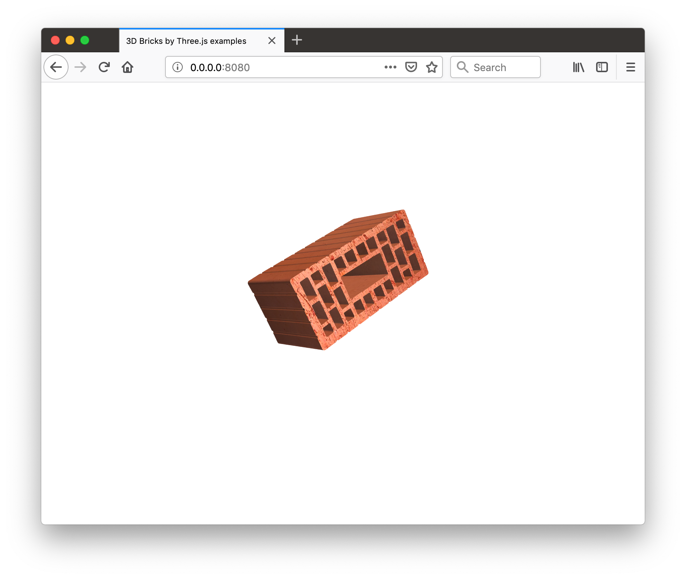

# 3d-bricks-models-threejs
3D bricks models for visualise in browser used tree.js 3d library 
Project from 2014 year.
## Launch
You can use an any HTTP Server, for instance:
`python -m SimpleHTTPServer 8080`

## Demo

      
